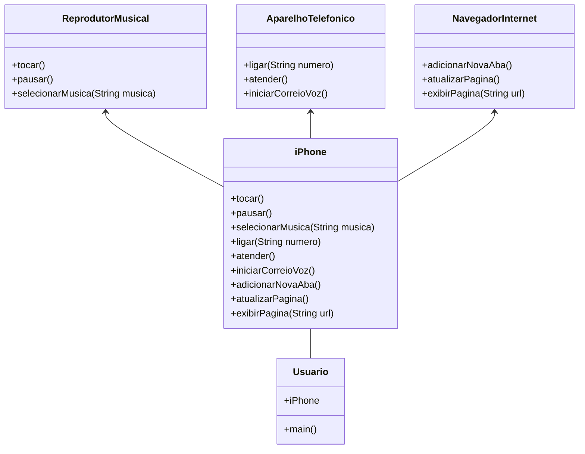

## Diagrama UML do Iphone

## Implementação
Dentro da pasta existe toda a implementação das interfaces e classes correspondentes ao diagrama representado acima, com a classe "Usuario" chamando os metodos implementados pela classe "iPhone".